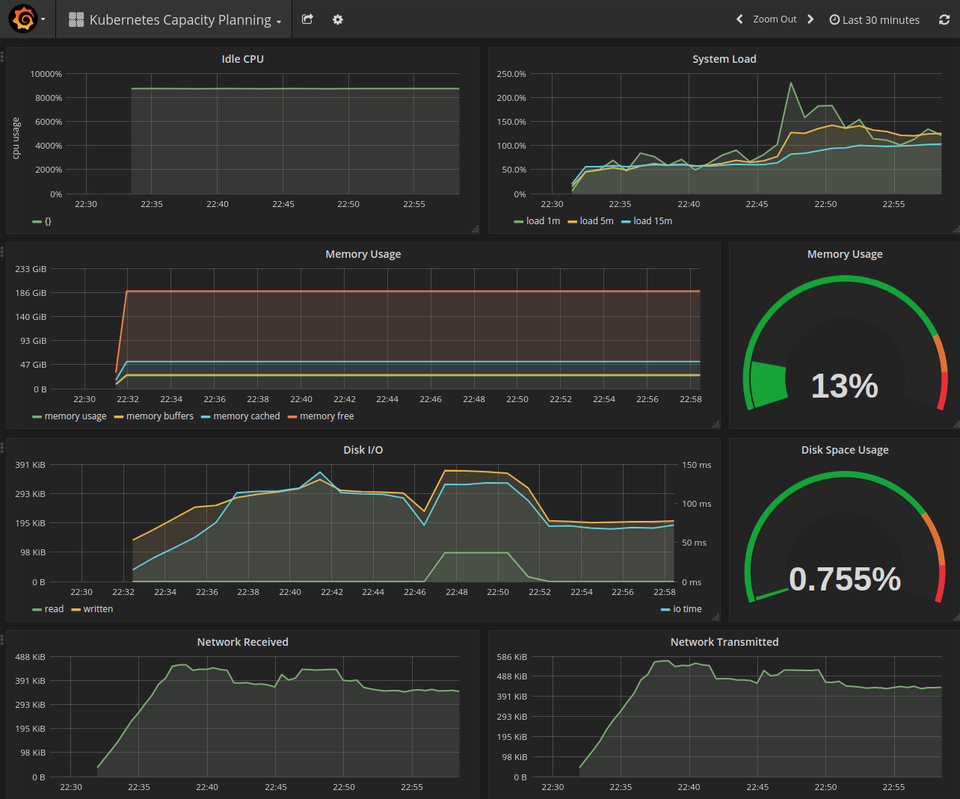
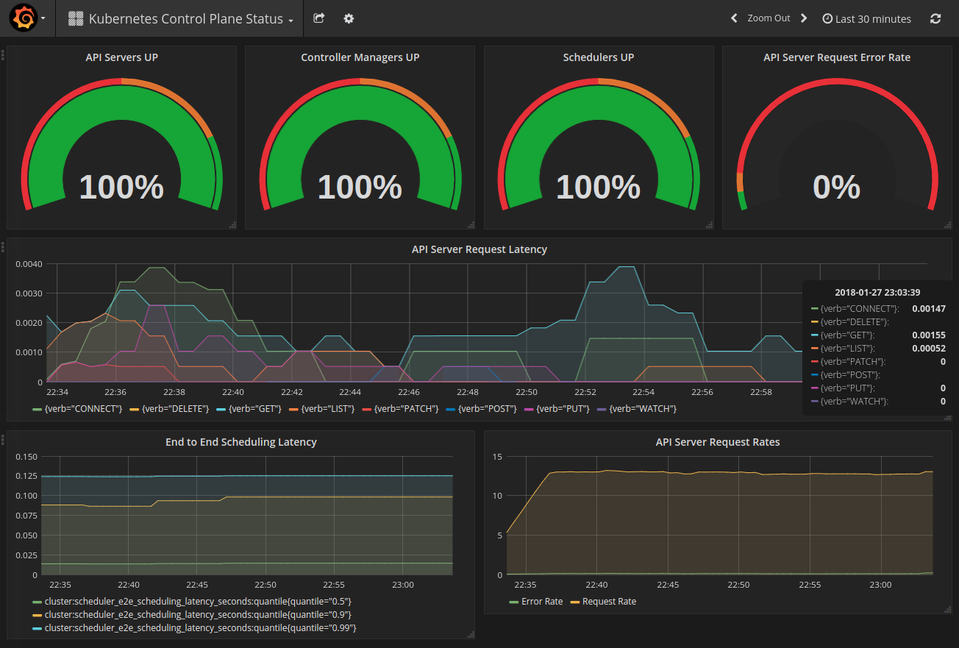
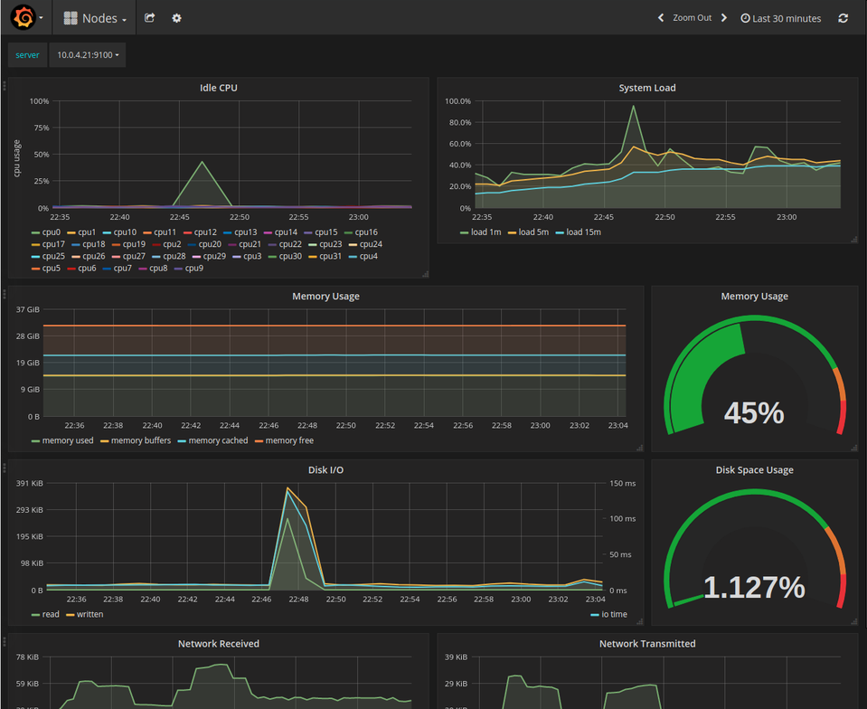

## Grafana

Grafana can be used to build dashboards and visualizations that use Prometheus as the datasource. Create the grafana deployment and service.

```
kubectl apply -f addons/grafana -R
```

Use `kubectl` to authenticate to the apiserver and create a local port-forward to the Grafana pod.

```
kubectl port-forward grafana-POD-ID 8080 -n monitoring
```

Visit [127.0.0.1:8080](http://127.0.0.1:8080) to view the bundled dashboards.





