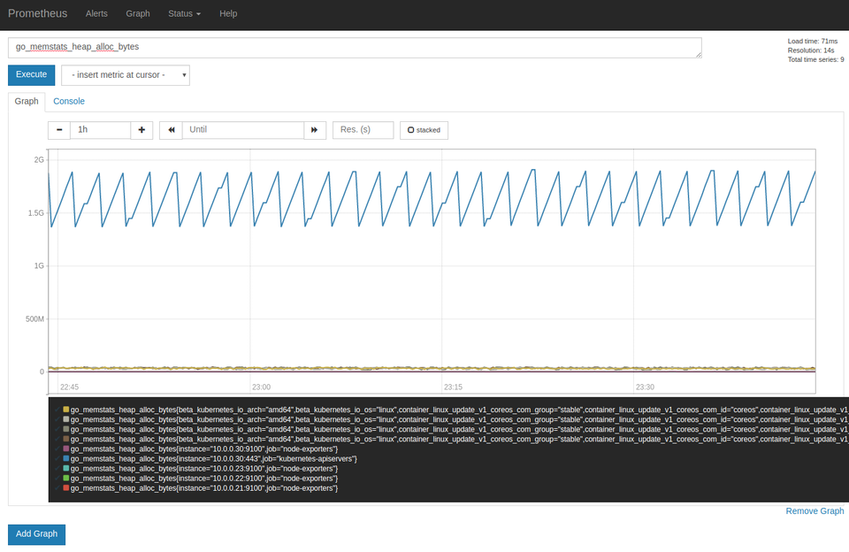
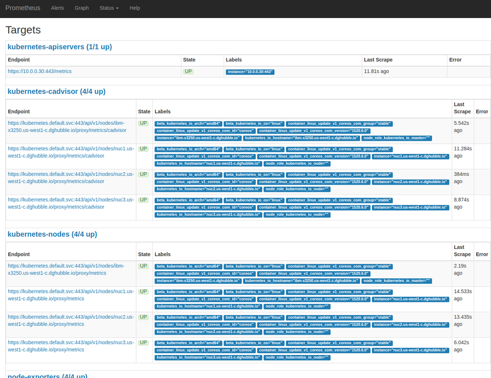
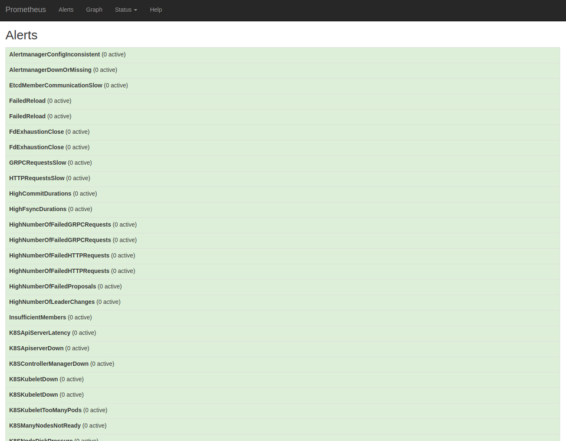

# Prometheus

Prometheus collects metrics (e.g. `node_memory_usage_bytes`) from *targets* by scraping their HTTP metrics endpoints. Targets are organized into *jobs*, defined in the Prometheus config. Targets may expose counter, gauge, histogram, or summary metrics.

Here's a simple config from the Prometheus [tutorial](https://prometheus.io/docs/introduction/getting_started/).

```
global:
  scrape_interval: 15s
scrape_configs:
  - job_name: 'prometheus'
    scrape_interval: 5s
    static_configs:
      - targets: ['localhost:9090']
```

On Kubernetes clusters, Prometheus is run as a Deployment, configured with a ConfigMap, and accessed via a Service or Ingress.

```
kubectl apply -f addons/prometheus -R
```

The ConfigMap configures Prometheus to discover apiservers, kubelets, cAdvisor, services, endpoints, and exporters. By default, data is kept in an `emptyDir` so it is persisted until the pod is rescheduled.

### Exporters

Exporters expose metrics for 3rd-party systems that don't natively expose Prometheus metrics.

* [node_exporter](https://github.com/prometheus/node_exporter) - DaemonSet that exposes a machine's hardware and OS metrics
* [kube-state-metrics](https://github.com/kubernetes/kube-state-metrics) - Deployment that exposes Kubernetes object metrics
* [blackbox_exporter](https://github.com/prometheus/blackbox_exporter) - Scrapes HTTP, HTTPS, DNS, TCP, or ICMP endpoints and exposes availability as metrics

### Queries and Alerts

Prometheus provides a basic UI for querying metrics and viewing alerts. Use `kubectl` to authenticate to the apiserver and create a local port-forward to the Prometheus pod.

```
kubectl get pods -n monitoring
kubectl port-forward prometheus-POD-ID 9090 -n monitoring
```

Visit [127.0.0.1:9090](http://127.0.0.1:9090) to query [expressions](http://127.0.0.1:9090/graph), view [targets](http://127.0.0.1:9090/targets), or check [alerts](http://127.0.0.1:9090/alerts).


<br/>

<br/>


Use [Grafana](/addons/grafana.md) to view or build dashboards that use Prometheus as the datasource.
